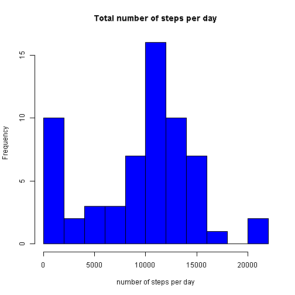
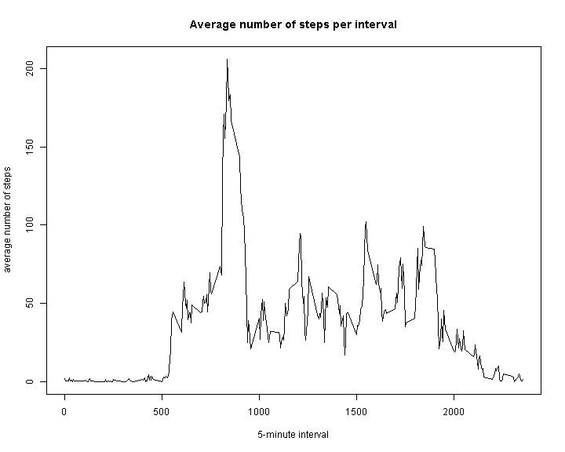
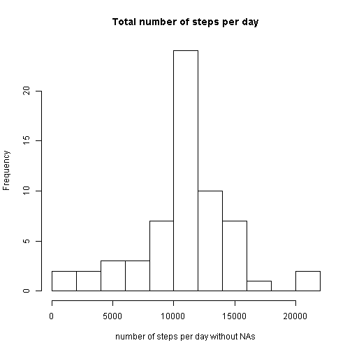
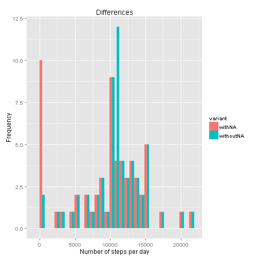
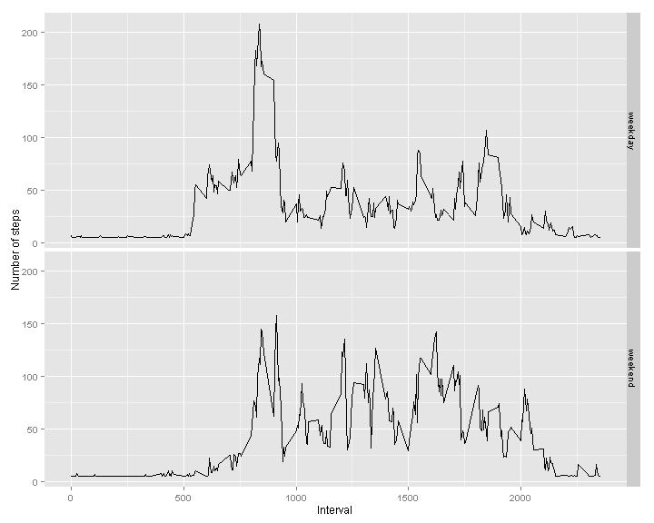

#Reproducible Research Assignment 1
_____________________________________________________________________________

##1. Loading and preprocessing the data

Load data from zip

```r
df <- read.csv(unzip("repdata-data-activity.zip"))
```

##2. Mean total number of steps taken per day

the total number of steps taken per day

```r
stepsperday <- tapply(df$steps, INDEX=df$date,  function(e){sum(e, na.rm = T)})
```

histogram of the total number of steps taken each day

```r
hist(stepsperday, breaks = 10, main = "Total number of steps per day", xlab = 
         "number of steps per day", col="blue")
```

 

mean and median of the total number of steps taken per day

```r
tm <- round(mean(stepsperday, na.rm = T))
tq <- round(quantile(stepsperday, probs = 0.5)[1])
```
Mean  | Median
------------- | -------------
9354  | 1.0395 &times; 10<sup>4</sup>

##3. The average daily activity pattern
time series plot of the 5-minute interval (x-axis) and the average number of steps taken, averaged across all days (y-axis)

```r
stepsperinterval <- data.frame(tapply(df$steps, df$interval, function(e) {mean(e, na.rm = T)}))
plot(x=row.names(stepsperinterval), y=stepsperinterval[,1], type = "l", main = "Average number of steps per interval", xlab = "5-minute interval", ylab = "average number of steps")
```

 

5-minute interval, on average across all the days in the dataset, Which contains the maximum number of steps

```r
max <- which(stepsperinterval[,1]==max(stepsperinterval[,1]), arr.ind = T)
row.names(stepsperinterval)[max]
```

```
## [1] "835"
```

##4. Imputing missing values
The total number of rows with NAs equals 2304, all NAs are in column `steps`

```r
sapply(X = df, function(e) sum(is.na(e)))
```

```
##    steps     date interval 
##     2304        0        0
```

I create a new dataset `df2` that is equal to the original dataset but with the 
missing data filled in.
I use the mean for that day to fill the missing values. But there are 8 days 
which don't  contain non-missing values, so I am going to use the total mean

```r
meanperday <- tapply(df$steps, INDEX=df$date,  function(e){round(mean(e, na.rm = T))})
meanperday[is.nan(meanperday)] <- mean(df$steps, na.rm = T)
df2 <- df # new dataset where i'm going to fill the missing value
vectna <- is.na(df2$steps)
for (i in 1:sum(vectna)) {
    df2[vectna,"steps"][i] <- meanperday[df2[vectna,"date"][i]]
}
# check
sum(is.na(df2$steps))
```

```
## [1] 0
```

the total number of steps taken per day

```r
stepsperday2 <- tapply(df2$steps, INDEX=df$date,  function(e){sum(e, na.rm = T)})
```

histogram of the total number of steps taken each day

```r
hist(stepsperday2, breaks = 10, main = "Total number of steps per day", xlab = "number of steps per day without NAs")
```

 

mean and median of the total number of steps taken per day

```r
tm2 <- round(mean(stepsperday2, na.rm = T))
tq2 <- round(quantile(stepsperday2, probs = 0.5)[1])
```
Mean  | Median
------------- | -------------
1.0766 &times; 10<sup>4</sup>  | 1.0766 &times; 10<sup>4</sup>


Do these values differ from the estimates from the first part of the assignment? What is the impact of imputing missing data on the estimates of the total daily number of steps?


```r
library(ggplot2)
tmp1 <- data.frame(stepsperday=stepsperday)
tmp1$variant <- "withNA"
tmp2 <- data.frame(stepsperday=stepsperday2)
tmp2$variant <- "withoutNA"
tmp <- rbind(tmp1, tmp2)
ggplot(tmp, aes(x=stepsperday, fill=variant))+ geom_bar(position = "dodge")+ xlab("Number of steps per day") + ylab("Frequency") + labs(title = "Differences")
```

 


##5. Differences in activity patterns between weekdays and weekends
I create a new factor variable in the dataset with two levels "weekday" and "weekend" indicating whether a given date is a weekday or weekend day.
I use the dataset `df2` with the filled-in missing values for this part.

```r
library(lubridate)
# new factor variable
df2$weekday <- factor(ifelse(wday(as.Date(df2$date)) %in% c(1,7),"weekend", "weekday"))
```

A panel plot containing a time series plot (i.e. type = "l") of the 5-minute interval (x-axis) and the average number of steps taken, averaged across all weekday days or weekend days (y-axis)

```r
library(dplyr)
stepsperinterval2 <- group_by(df2, interval, weekday)
stepsperinterval2 <- summarise(stepsperinterval2, steps=round(mean(steps)))
```

```r
ggplot(data = stepsperinterval2, aes(x=interval, y=steps))+geom_line()+
    xlab("Interval") + ylab("Number of steps") + facet_grid(weekday~.)
```

 


